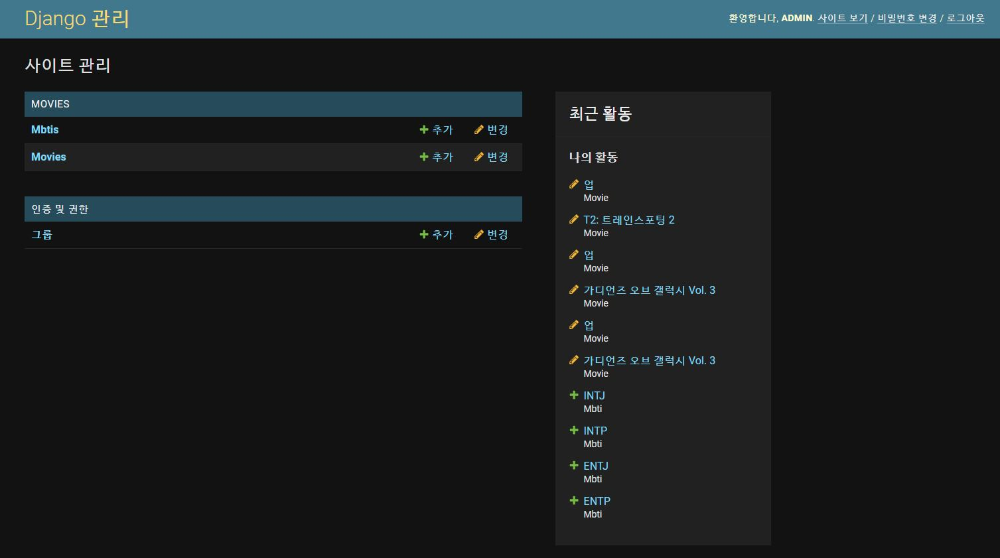
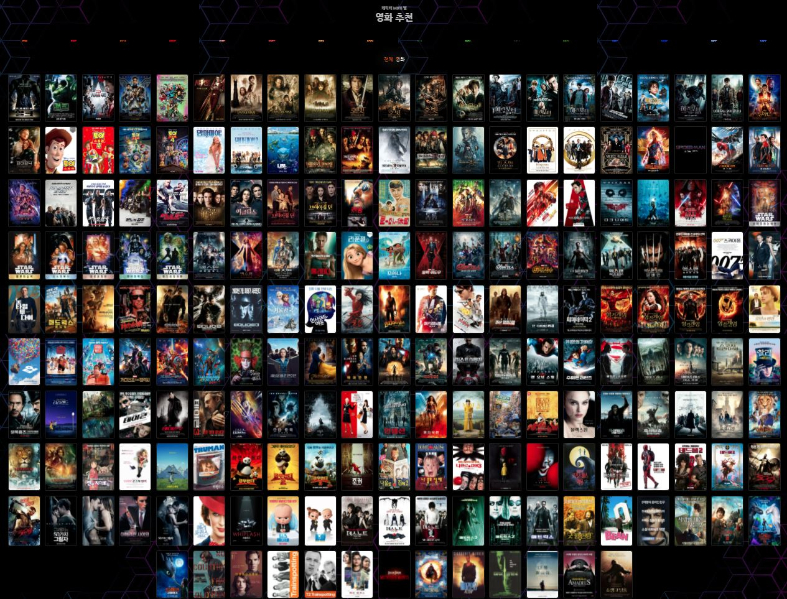
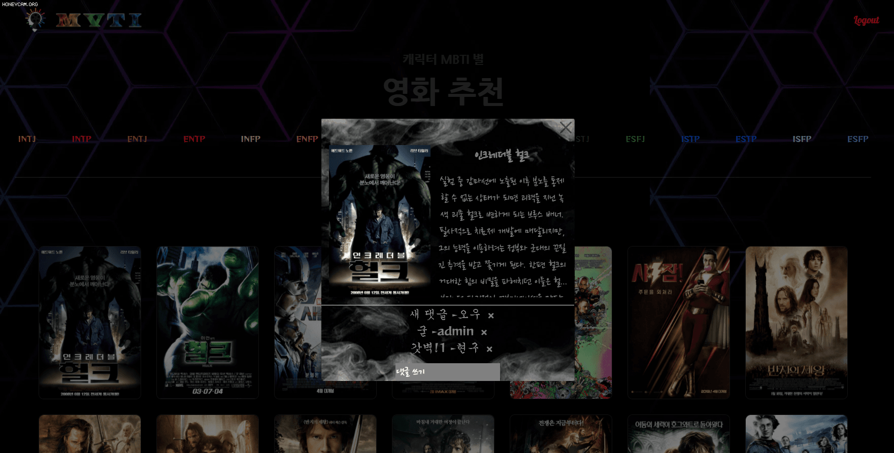
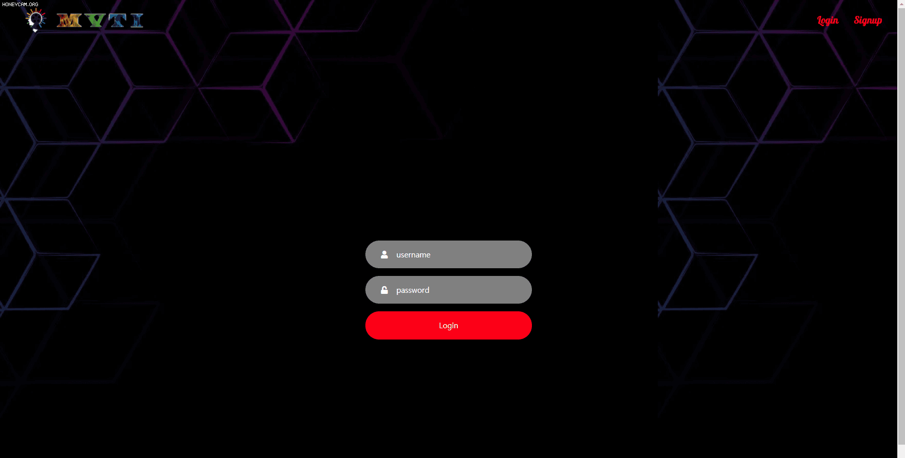
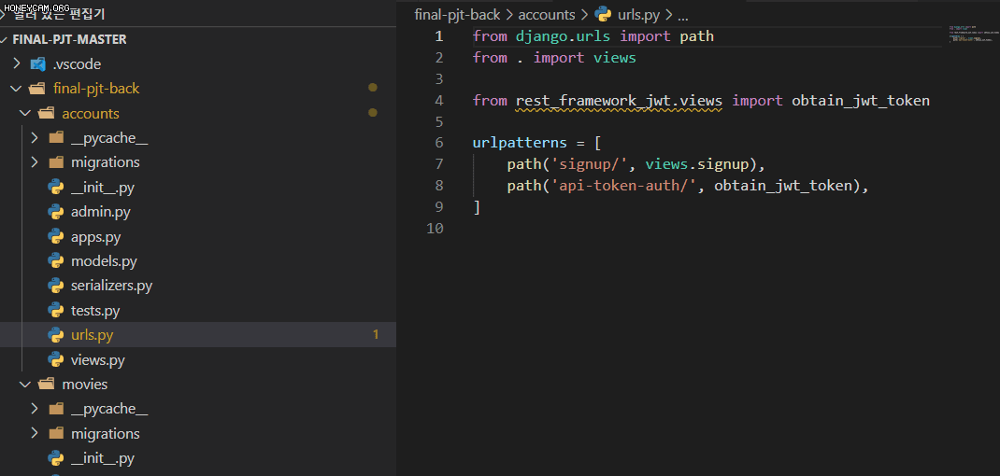
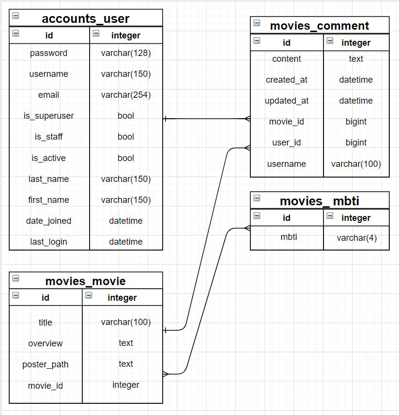
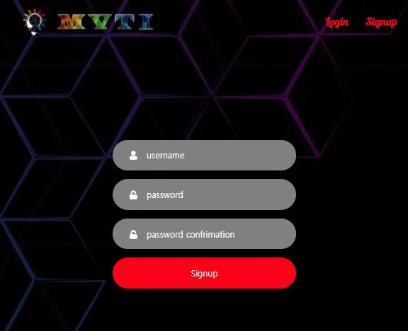
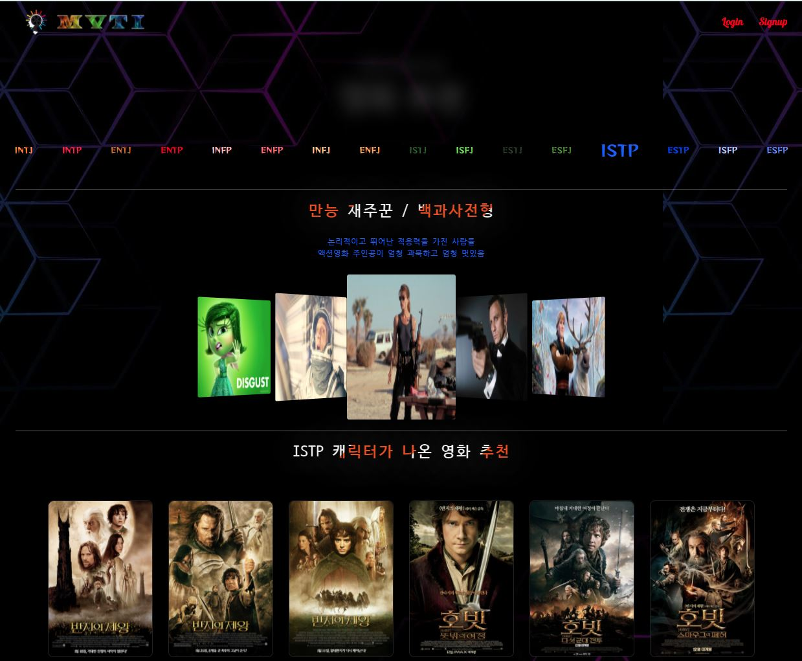
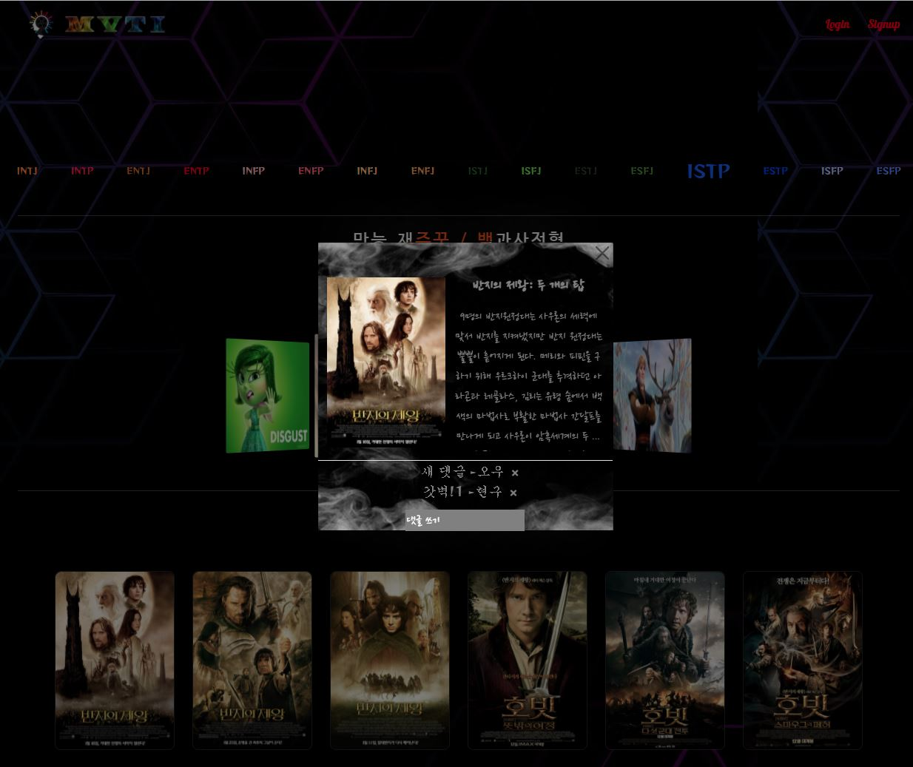

# Final - Project(권오우,강현구)

## 1. 목표 

​	⚫ 영화 정보 기반 추천 서비스 구성 

​	⚫ 커뮤니티 서비스 구성 

​	⚫ HTML, CSS, JavaScript, Vue.js, Django, REST API, DataBase 등을 활용한 실제 서비 스 설계 

​	⚫ 서비스 관리 및 유지보수

## 2. 개발환경 

​	<span style="color:RED">A</span>. 언어 

​		 i. Python 3.8+ 

​	 	ii. Django 3.X    :heavy_check_mark:

​	 	iii. Node 14.X  

​	 	iv. Vue.js 2.+    :heavy_check_mark:

​	 <span style="color:RED">B</span>. 도구 

​	  	i. vsCode    :heavy_check_mark:

​	 	 ii. Chrome Browser 

​	<span style="color:RED">C</span>. 아키텍처 

​		 i. Django & Vanila JS 

​	 	ii. Django REST API 서버 & Vue.js    :heavy_check_mark:

## 3. 서비스 개요

​	<span style="color:RED">A</span>. 본 프로젝트는 ‘영화’를 주제로 진행되기 때문에, 영화 정보 데이터베이스 를 필수적으로 가지고 있어야 합니다.

​		 i. 데이터를 수집하는 방법은 제한없이 자유롭게 진행합니다. 

​		 ii. 영화 데이터 수집 예시는 다음과 같습니다

​					1. 영화 진흥 위원회 

​					2. 네이버 검색 API(영화)  

​					3. The Movie Database(TMDB)    :heavy_check_mark:

​		 iii. 최초에 각 팀 별로 등록된 영화 레코드(record)는 최소 50개 이상을 유 지해야 합니다.   

​	

​	<span style="color:RED">B</span>. 모바일 대응을 위한 반응형 웹, Django REST API 서버 및 프론트엔드 프레 임워크(Vue.js) 분리 등의 

​		상세 구현 방식은 자유롭게 구성하되, 프로젝트 README.md 상단에 프로젝트 구조에 대한 설명을 

​		반드시 명시해야 합니 다		 

​	span

​	<span style="color:RED">C</span>. 영화 커뮤니티에 필요한 기능을 구성하여야 합니다

​	<span style="color:RED">D</span>. 사용자에게 제공되는 영화 추천 방식은 자유롭게 구성하되 해당 서비스를 이용하는 

​		 사용자는 반드시 영화를 추천 받을 수 있어야 합니다

​	<span style="color:RED">E</span>. 최소한의 HTML/CSS를 통해 웹 사이트를 디자인 해야합니다.


## 4. 요구사항

​	아래의 세부 요구사항은 필수 기능으로 프로젝트 내에 반드시 포함되어야 합니다. 이 외의 추가적인 기능 및 디자인 등	은 팀 별로 자유롭게 수행할 수 있습니다.

​	<span style="color:RED">A</span>. 관리자 뷰

​			 i. 관리자 권한의 유저만 영화 등록 / 수정 / 삭제 권한을 가집니다. 

​			ii. 관리자 권한의 유저만 유저 관리 권한을 가집니다. 

​			iii. 장고에서 기본적으로 제공하는 admin 기능을 이용하여 구현합니다.

​			iv. Vue.js를 활용하는 경우에도 Django admin기능을 이용하여 구현할 수 있습니다

			

​	<span style="color:RED">B</span>. 영화 정보 

​		 i. 영화 정보는 Database Seeding을 활용하여 최소 50개 이상의 데이터가 존재 하도록 구성해야 합니다. 

​		 ii. 모든 로그인 된 유저는 영화에 대한 평점 등록 / 수정 / 삭제 등을 할 수 있 어야 합니다.

			

​	<span style="color:RED">C</span>. 추천 알고리즘 

​		 i. 평점을 등록한 유저는 해당 정보를 기반으로 영화를 추천 받을 수 있어야 합니다. 

​		 ii. 추천 알고리즘의 지정된 형식은 없으나, 사용자는 반드시 최소 1개 이상의 방식으로 

​			영화를 추천 받을 수 있어야 합니다. 

​		 iii. 추천 방식은 각 팀별로 자유롭게 선택할 수 있으며 어떠한 방식으로 

​		 	추천 시스템을 구성 했는지 설명할 수 있어야 합니다.


​		<span style="color:RED">D</span>. 커뮤니티 

​			 i. 영화 정보와 관련된 대화를 할 수 있는 커뮤니티 기능을 구현해야 합니다. 

​			 ii. 로그인한 사용자만 글을 조회 / 생성 할 수 있으며 작성자 본인만 글을 수정 / 삭제 할 수 있습니다. 

​			 iii. 사용자는 작성된 게시글에 댓글을 작성할 수 있어야 하며 작성자 본인만 댓 글을 삭제 할 수 있습니다. 

​			 iv. 각 게시글 및 댓글은 생성 및 수정 시각 정보가 포함되어야 합니다

```python
class Comment(models.Model):
    content = models.TextField()
    user = models.ForeignKey(settings.AUTH_USER_MODEL, on_delete=models.CASCADE, related_name='comment')
    movie = models.ForeignKey(Movie, on_delete=models.CASCADE)
    created_at = models.DateTimeField(auto_now_add=True)
    updated_at = models.DateTimeField(auto_now=True)
    username = models.CharField(max_length=100)
```






​	<span style="color:RED">E</span>. 기타 

​			 i. 최소한 5개 이상의 URL 및 페이지를 구성해야 합니다. 

​			 ii. HTTP Method와 상태 코드는 상황에 맞게 적절하게 반환되어야 하며, 

​				 필요에 따라 메시지 프레임워크 등을 사용하여 에러 페이지를 구성해야 합니다. 

​			 iii. 필요한 경우 Ajax를 활용한 비동기 요청을 통해 사용자 경험을 적절하게 향상 시켜야 합니다.




## 5. 결과

​	:

. 🔴 팀원 정보 및 업무 분담 내역 

​		 	팀장 : 권오우 (Back담당)

​			 팀원 : 강현구 (Font담당)

 🔴 데이터베이스 모델링(ERD) 

​	

 🔴 목표 서비스 구현 및 실제 구현 정도

​		저희가 만든 MVTI 는 영화속 캐릭터들의 MBTI 를 분석하여 그 캐릭터와 비슷한 MBTI를 가진 캐릭터이 누가 있으며 

​		또한 그들이 등장한 영화들을 추천해주는 사이트입니다.







🔴 배포 서버 URL 

```
https://clever-yonath-1bd2e3.netlify.app/
```

 🔴 기타(느낀점)

`권오우`

```
1주일 동안 프로젝트를 진행하며 5달 동안 배웠던 모든 것을 되짚어 가며 우리만의 프로젝트를 구현하는 것에 보람을 느꼈습니다. 진행하는 중간에 프로젝트 진행이 막히게 되면 답답함도 느꼈고 때로는 아직 많이 부족하다는 것을 느꼈습니다. 하지만 현구님과 같이 해결하기 위해 많은 자료들을 찾아보고 시행착오를 겪으며 문제를 해결해 나갔고, 완벽하게 문제가 해결 되었을 때 느낀 희열은 잊을 수 없을 것입니다. 1주일 이라는 짧은 시간 동안 원하는 모든 기능을 구현한 것은 아니지만 필요한 부분들은 모두 시간 안에 구현해서 매우 보람찬 1주일이 된 것 같습니다.
```


`강현구`

```
그동안의 프로젝트들과 수업들을 총괄적으로 종합하고 오우님과 저의 입맛에 맞춰 1주일동안의 시간을 투자하여 괜찮은 영화추천사이트를 만들어서 너무 기쁩니다. 이번 프로젝트에서 오우님의 엄청난 활약으로 막혔던 부분들을 수월하게 해결할 수 있었으며, 프로젝트를 하다보면 서로 의견이 갈리거나 이런 부분들을 서로 조율해가면서 해야하지만 오우님과 저랑 대부분 의견일치가 이뤄졌기 때문에 이러한 부분들로 인해 시간적 여유가 생겼고, 프론트쪽에 좀 더 시간을 쓸 수 있었습니다.  저희는 단순하게 TMDB 사이트에서 영화정보만 가져오는것이 아니라 그 json 파일도 우리 입맛에 맞게 202편의 영화들 MBTI부분 전부 추가해 주었고, MBTI와 MOVIE를 썪은 MVTI 로고도 제작해 보았습니다. 저는 이번 프로젝트를 하면서 프론트쪽이 제가 재미있어하고, 좋아하는걸 느꼈고, 동시에 많이 부족하는걸 느꼈습니다. 사실 혼자했다면 이렇게까지 구현 불가능했겠지만 오우님이 제의 부족한 부분들을 많이 매꿔주셨기 때문에 너무 감사하고, 동시에 미안한 마음이 듭니다. 이번 방학때 vue부분들 조금 더 공부할 수 있도록하여 제가 원하는 것들 꾸미고 만들 수 있도록 시간을 가져봐야겠습니다.
```

